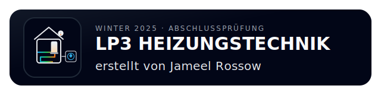

  

## Dokumentation zur Abschlussprüfung – TGA-Systemplanung Heizung

Dieses Repository enthält die vollständige Projektstruktur meiner Abschlussprüfung im Schwerpunkt Heizungstechnik (LP3 – Entwurfsplanung).  
Anstatt die Unterlagen in statische Word-Formulare zu pressen, setze ich auf einen modernen, reproduzierbaren Workflow:  
Agenten generieren Rohtexte, Skripte validieren und konsolidieren Inhalte, und der Viewer stellt alles sauber als Markdown-„Seiten“ dar.  
So kann ich mich auf das Wesentliche konzentrieren: Systemkonzept, Berechnungen und technische Argumentation.

## 📁 Projektstruktur im Überblick
| Bereich | Zweck |
| --- | --- |
| `agent_workflow` | Enthält alle Agent-Prompts, Run-Konfigurationen und Tool-Wrapper. Damit lassen sich Text-, Analyse- und Dokumentationsschritte reproduzierbar ausführen. |
| `docs` / `documents4docs` | Exportierte MD-/PDF-Versionen, Assets und Zwischenstände, bevor sie in die finale Abgabe übernommen werden. |
| `Runbook` | Zentrale Regeln, Workflows, Styleguides und Guardrails für alle automatischen Schritte (Viewer, Agenten, Skripte). |
| `scripts` | Kleine Hilfsprogramme zum Generieren, Prüfen, Zusammenführen und Aufräumen – alles, was repetitive Aufgaben reduziert. |
| `viewer` | HTML/CSS/JS-Frontend zur lokalen Ansicht der einzelnen Markdown-Kapitel und zur Vorbereitung für GitHub Pages. |
| `commit` / `commit.py` | Automatisiertes Commit-System: erzeugt strukturierte Commit-Messages und dokumentiert Agent-Iterationen. |
| `.venv`, `.env`, `run.py`, `stop.py` | Technische Basis: virtuelle Umgebung, Environment-Variablen sowie Start-/Stop-Skripte für den Agent-Stack. |

## 🌐 Projekt-Viewer (GitHub Pages)
Die Dokumentation kann direkt hier betrachtet werden:  
👉 https://jameelrossow.github.io/2025_Winter-Heizungstechnik/

## ℹ️ Ziel dieses Repositories
Dieses Repo dient als:
- Arbeits-, Dokumentations- und Datenbasis für die gesamte LP3-Entwurfsplanung
- Entwicklungsumgebung für den agentenbasierten Dokumentations-Workflow
- Ablage der finalen prüfungsrelevanten Unterlagen (Pläne, Tabellen, MD-Kapitel, Anhänge)

Alle Inhalte sind so strukturiert, dass sie versionierbar, nachvollziehbar und jederzeit reproduzierbar bleiben.
